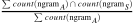

# Binary Classification of Plagiarized Text using Support Vector Machine (SVM)


## Table Of Contents


- [Introduction](#introduction)
- [Setup Instructions](#setup-instructions)
  * [Log in to the AWS console and create a notebook instance](#log-in-to-the-aws-console-and-create-a-notebook-instance)
  * [Use git to clone the repository into the notebook instance](#use-git-to-clone-the-repository-into-the-notebook-instance)
- [Machine Learning Pipeline](#machine-learning-pipeline)
  * [Step 1 - Loading and exploring the data](#step-1---loading-and-exploring-the-data)
    + [Part A - Calculating the percentage of fraudulent data](#part-a---calculating-the-percentage-of-fraudulent-data)
  * [Step 2 - Splitting data into training and test sets](#step-2---splitting-data-into-training-and-test-sets)
  * [Step 3 - Binary classification](#step-3---binary-classification)
    + [Part A - Define a LinearLearner model](#part-a---define-a-linearlearner-model)
    + [Part B - Train the model](#part-b---train-the-model)
    + [Part C - Evaluate model performance](#part-c---evaluate-model-performance)
  * [Step 4 - Making improvements to the model](#step-4---making-improvements-to-the-model)
    + [Part A - Tune for higher recall](#part-a---tune-for-higher-recall)
    + [Part B - Manage class imbalance](#part-b---manage-class-imbalance)
    + [Part C - Tune for higher precision](#part-c---tune-for-higher-precision)
  * [Important - Deleting the endpoint](#important---deleting-the-endpoint)


## Introduction


The goal of this project was to build a plagiarism detector that compares a provided answer text file against a source text file and labels the answer file as being plagiarized or original, depending on the similarities between the two text files. A [Support Vector Machine (SVM)](https://en.wikipedia.org/wiki/Support_vector_machine) was used to build a binary classification model and detect plagiarization. [Scikit-learn SVC](https://scikit-learn.org/stable/modules/svm.html#svm-classification) is an implementation of a classifier built using an SVM and it is naturally a good fit for classification problems. In this project, due to the smaller size of the dataset (< 10,000 samples), LinearSVC was not needed to optimize training time and the standard SVC implementation was used.


The model detects plagiarism by computing similarity features that measure how similar a given answer text is as compared to the original source text. The similarity features used in this project are documented in [this paper on plagiarism detection](https://www.researchgate.net/publication/220147549_Developing_a_corpus_of_plagiarised_short_answers). One of the similarity features calculated by the model is containment which is defined as the sum of common [n-grams](https://en.wikipedia.org/wiki/N-gram) between the answer and source texts. The principle behind this is that the greater the number of similar excerpts of a certain length between two documents, the more likely it is that the text was plagiarized.





Another similarity feature used by the model was [Longest Common Subsequence (LCS)](https://en.wikipedia.org/wiki/Longest_common_subsequence_problem), which calculates the longest sequential combination of words that are similar between the answer and source texts. By taking into account the length of the LCS between two documents, the model is able to detect plagiarism more effectively. Everything for this project was done on Amazon Web Services (AWS) and their SageMaker platform as the goal of this project was to further familiarize myself with the AWS ecosystem.


## Setup Instructions


The notebook in this repository is intended to be executed using Amazon's SageMaker platform and the following is a brief set of instructions on setting up a managed notebook instance using SageMaker.


### Log in to the AWS console and create a notebook instance


Log in to the AWS console and go to the SageMaker dashboard. Click on 'Create notebook instance'. The notebook name can be anything and using ml.t2.medium is a good idea as it is covered under the free tier. For the role, creating a new role works fine. Using the default options is also okay. Important to note that you need the notebook instance to have access to S3 resources, which it does by default. In particular, any S3 bucket or object with 'sagemaker' in the name is available to the notebook.


### Use git to clone the repository into the notebook instance


Once the instance has been started and is accessible, click on 'Open Jupyter' to get to the Jupyter notebook main page. To start, clone this repository into the notebook instance.


Click on the 'new' dropdown menu and select 'terminal'. By default, the working directory of the terminal instance is the home directory, however, the Jupyter notebook hub's root directory is under 'SageMaker'. Enter the appropriate directory and clone the repository as follows.


```
cd SageMaker
git clone https://github.com/Supearnesh/ml-census-pca.git
exit
```


After you have finished, close the terminal window.


## Machine Learning Pipeline


This was the general outline followed for this SageMaker project:


1. Reading and exploring the data
        a. Understanding different types of plagiarism
2. Pre-processing the data
3. Feature engineering
        a. Containment
        b. Longest Common Subsequence (LCS)
        c. Evaluate model performance
4. Binary classification
        a. Define an SVC model
        b. Train the model
        c. Evaluate model performance
5. Important: Deleting the endpoint


### Step 1 - Reading and exploring the data


In order to build this plagiarism detection model, the data used was a slightly modified version of [a dataset created by Paul Clough (Information Studies) and Mark Stevenson (Computer Science), at the University of Sheffield](https://ir.shef.ac.uk/cloughie/resources/plagiarism_corpus.html).


> **Citation for data**: Clough, P. and Stevenson, M. Developing A Corpus of Plagiarised Short Answers, Language Resources and Evaluation: Special Issue on Plagiarism and Authorship Analysis, In Press. [Download]


```python
!wget https://s3.amazonaws.com/video.udacity-data.com/topher/2019/January/5c4147f9_data/data.zip
!unzip data
```

    --2020-06-28 22:00:02--  https://s3.amazonaws.com/video.udacity-data.com/topher/2019/January/5c4147f9_data/data.zip
    Resolving s3.amazonaws.com (s3.amazonaws.com)... 52.216.28.22
    Connecting to s3.amazonaws.com (s3.amazonaws.com)|52.216.28.22|:443... connected.
    HTTP request sent, awaiting response... 200 OK
    Length: 113826 (111K) [application/zip]
    Saving to: ‘data.zip’
    
    data.zip            100%[===================>] 111.16K  --.-KB/s    in 0.004s  
    
    2020-06-28 22:00:02 (27.4 MB/s) - ‘data.zip’ saved [113826/113826]
    
    Archive:  data.zip
       creating: data/


#### Part A - Understanding different types of plagiarism


Each text file in the `data` directory from unzipping the archive above contains a reponse to a short question. Each file is associated with a **Task** (A-E) and a **Category** of plagiarism.


The **Task** column contains a value corresponding to the prompt, or short question, for which the file contains a response:
* Each task, marked from `a` through `e`, corresponds to a question related to Computer Science
* For Instance, Task A asks the question: "What is inheritance in object oriented programming?"


The **Category** column refers to the degree of plagiarism:


1. `cut`: An answer is plagiarized; it is copy-pasted directly from the relevant Wikipedia source text
2. `light`: An answer is plagiarized; it is based on the Wikipedia source text and includes some copying and paraphrasing
3. `heavy`: An answer is plagiarized; it is based on the Wikipedia source text but expressed using different words and structure
4. `non`: An answer is not plagiarized; the Wikipedia source text is not used to create this answer
5. `orig`: This is a specific category for the original Wikipedia source text used only for comparison purposes


> Out of the submitted files, the only category that does not contain any plagiarism is `non`.


```python
# print out some stats about the data
print('Number of files: ', plagiarism_df.shape[0])  # .shape[0] gives the rows 
# .unique() gives unique items in a specified column
print('Number of unique tasks/question types (A-E): ', (plagiarism_df['Task'].unique()))
print('Unique plagiarism categories: ', (plagiarism_df['Category'].unique()))
```

    Number of files:  100
    Number of unique tasks/question types (A-E):  ['a' 'b' 'c' 'd' 'e']
    Unique plagiarism categories:  ['non' 'cut' 'light' 'heavy' 'orig']


### Step 2 - Pre-processing the data


In order to proceed with training a machine learning model, any categorical data needs to be converted to numerical data. For instance, any data in the `Category` column, which defines the degree of plagiarism, needs to be converted to a numerical value corresponding to the appropriate category. Further, a binary classifier will output only two values, so the result from the model will be whether an answer is plagiarized (1) or not (0). The below function `numerical_dataframe`  reads in a `file_information.csv` file by name, and returns a *new* DataFrame with a numerical `Category` column and new `Class` column that labels each answer as plagiarized or not.

The function returns a new DataFrame with the following properties:
* 4 columns: `File`, `Task`, `Category`, `Class` (the `File` and `Task` columns remain unchanged from the original `.csv` file)
* All `Category` labels are converted to numerical labels according to the following rules (a higher value indicates a higher degree of plagiarism):
    * 0 = `non`
    * 1 = `heavy`
    * 2 = `light`
    * 3 = `cut`
    * -1 = `orig` (this is a special value indicating an original file)
* In the new `Class` column:
    * Any answer text that is not plagiarized (`non`) should have the class label `0`
    * Any plagiarized answer texts should have the class label `1`
    * And any `orig` texts will have a special label `-1`


After running the function, the result should be a DataFrame with rows that look like the following:


```
        File         Task  Category  Class
0    g0pA_taska.txt    a      0       0
1    g0pA_taskb.txt    b      3       1
2    g0pA_taskc.txt    c      2       1
3    g0pA_taskd.txt    d      1       1
4    g0pA_taske.txt    e      0       0
...
...
99   orig_taske.txt    e     -1      -1

```


```python
# Read in a csv file and return a transformed dataframe
def numerical_dataframe(csv_file='data/file_information.csv'):
    '''Reads in a csv file which is assumed to have `File`, `Category` and `Task` columns.
       This function does two things: 
       1) converts `Category` column values to numerical values 
       2) Adds a new, numerical `Class` label column.
       The `Class` column will label plagiarized answers as 1 and non-plagiarized as 0.
       Source texts have a special label, -1.
       :param csv_file: The directory for the file_information.csv file
       :return: A dataframe with numerical categories and a new `Class` label column'''
    
    # read input csv and create 'Class' column
    plagiarism_df = pd.read_csv(csv_file)
    plagiarism_df['Class'] = plagiarism_df['Category']
    
    # mappings for category labels 
    category_map = {'orig':-1, 'non':0, 'heavy':1, 'light':2, 'cut':3}
    class_map = {'orig':-1, 'non':0, 'heavy':1, 'light':1, 'cut':1}
    
    # convert column values to numerical mappings
    plagiarism_df = plagiarism_df.replace({'Category':category_map})
    plagiarism_df = plagiarism_df.replace({'Class':class_map})
    
    return plagiarism_df
```


### Step 3 - Feature engineering


It is important to consider which features should be included in a plagiarism detection model and how to calculate such features. In the following explanations, the submitted text file will be referred to as a **Student Answer Text (A)** and the original, wikipedia source file (that the answer will be compared against) as the **Wikipedia Source Text (S)**.


#### Part A - Containment


The first task will be to create **containment features**. To understand containment, it is good to have foundational knowledge of [n-grams](https://en.wikipedia.org/wiki/N-gram). An *n-gram* is a sequential word grouping. For example, in a line like "bayes rule gives us a way to combine prior knowledge with new information," a 1-gram is just one word, like "bayes." A 2-gram might be "bayes rule" and a 3-gram might be "combine prior knowledge."


> Containment is defined as the **intersection** of the n-gram word count of the Wikipedia Source Text (S) with the n-gram word count of the Student  Answer Text (S) *divided* by the n-gram word count of the Student Answer Text.


$$ \frac{\sum{count(\text{ngram}_{A}) \cap count(\text{ngram}_{S})}}{\sum{count(\text{ngram}_{A})}} $$


If the two texts have no n-grams in common, the containment will be 0, but if _all_ their n-grams intersect then the containment will be 1. Intuitively, it can be seen how having longer n-gram's in common, might be an indication of cut-and-paste plagiarism. In this project, the appropriate `n` or several `n`'s to use in the final model will be defined below.


With the `complete_df` that was created in the steps above, it is now possible to compare any Student Answer Text (A) with its appropriate Wikipedia Source Text (S). An answer for task A should be compared to the source text for task A, just as answers to tasks B, C, D, and E should be compared to the corresponding original source text.


The function, `calculate_containment` calculates containment based upon the following parameters:
* A given DataFrame, `df` (which is assumed to be the `complete_df` from above)
* An `answer_filename`, such as 'g0pB_taskd.txt'
* An n-gram length, `n`


The general steps in this function are as follows:
1. From *all* of the text files in a given `df`, an array of n-gram counts is created using a [CountVectorizer](https://scikit-learn.org/stable/modules/generated/sklearn.feature_extraction.text.CountVectorizer.html)
2. The processed answer and source texts for the given `answer_filename` are retrieved
3. The containment between an answer and source text is calculated according to the following equation


    >$$ \frac{\sum{count(\text{ngram}_{A}) \cap count(\text{ngram}_{S})}}{\sum{count(\text{ngram}_{A})}} $$


4. The containment value is returned


```python
from sklearn.feature_extraction.text import CountVectorizer

# Calculate the ngram containment for one answer file/source file pair in a df
def calculate_containment(df, n, answer_filename):
    '''Calculates the containment between a given answer text and its associated source text.
       This function creates a count of ngrams (of a size, n) for each text file in our data.
       Then calculates the containment by finding the ngram count for a given answer text, 
       and its associated source text, and calculating the normalized intersection of those counts.
       :param df: A dataframe with columns,
           'File', 'Task', 'Category', 'Class', 'Text', and 'Datatype'
       :param n: An integer that defines the ngram size
       :param answer_filename: A filename for an answer text in the df, ex. 'g0pB_taskd.txt'
       :return: A single containment value that represents the similarity
           between an answer text and its source text.
    '''
    
    a_text, task = df[df['File'] == answer_filename][['Text', 'Task']].values.tolist()[0]
    s_text = df[(df['Task'] == task) & (df['Class'] == -1)]['Text'].values[0]

    # instantiate an ngram counter
    counts = CountVectorizer(analyzer='word', ngram_range=(n,n))
    
    # create array of n-gram counts for the answer and source text
    ngrams = counts.fit_transform([a_text, s_text])

    # row = the 2 texts and column = indexed vocab terms (as mapped above)
    # ex. column 0 = 'an', col 1 = 'answer'.. col 4 = 'text'
    ngram_array = ngrams.toarray()
    
    # the intersection can be found by looking at the columns in the ngram array
    # this creates a list that holds the min value found in a column
    # so it will hold 0 if there are no matches, and 1+ for matching word(s)
    intersection_list = np.amin(ngram_array, axis=0)
    
    # optional debug: uncomment line below
    # print(intersection_list)

    # sum up number of the intersection counts
    intersection = np.sum(intersection_list)
    
    # count up the number of n-grams in the answer text
    answer_idx = 0
    answer_cnt = np.sum(ngram_array[answer_idx])
    
    # normalize and get final containment value
    containment_val =  intersection / answer_cnt

    return containment_val
```


#### Part B - Longest Common Subsequence (LCS)


Containment a good way to find overlap in word usage between two documents; it may help identify cases of cut-and-paste as well as paraphrased levels of plagiarism. Since plagiarism is a fairly complex task with varying levels, it's often useful to include other measures of similarity. Another feature used to measure similarity is [**longest common subsequence**](https://en.wikipedia.org/wiki/Longest_common_subsequence_problem).


> The longest common subsequence is the longest string of words (or letters) that are *the same* between the Wikipedia Source Text (S) and the Student Answer Text (A). This value is also normalized by dividing by the total number of words (or letters) in the Student Answer Text.


The function `lcs_norm_word` calculates the *longest common subsequence* of words between a Student Answer Text and corresponding Wikipedia Source Text. 


A concrete example of a Longest Common Subsequence (LCS) problem may be as follows:
* Given two texts: text A (answer text) of length n, and string S (original source text) of length m, produce their longest common subsequence of words: the longest sequence of words that appear left-to-right in both texts (though the words don't have to be in continuous order)
* Consider:
    * A = "i think pagerank is a link analysis algorithm used by google that uses a system of weights attached to each element of a hyperlinked set of documents"
    * S = "pagerank is a link analysis algorithm used by the google internet search engine that assigns a numerical weighting to each element of a hyperlinked set of documents"
* In this case, the start of each sentence is fairly similar, having overlap in the sequence of words, "pagerank is a link analysis algorithm used by" before diverging slightly. Then **continue moving left -to-right along both texts** until the next common sequence is found; in this case it is only one word, "google". Next come "that" and "a" and finally the same ending "to each element of a hyperlinked set of documents"
* Below, is a clear visual of how these sequences were found, sequentially, in each text:


* Now, those words appear in left-to-right order in each document, sequentially, and even though there are some words in between, this is counted as the longest common subsequence between the two texts
* If each word found in common is counted up, the resulting value is 20, **so, LCS has length 20**
* Next, to normalize this value, divide by the total length of the student answer; in this example that length is only 27, **so, the function `lcs_norm_word` should return the value `20/27` or about `0.7408`**


In this way, LCS is a great indicator of cut-and-paste plagiarism or if someone has referenced the same source text multiple times in an answer.


By going through the scenario above, it can be seen that this algorithm depends on looking at two texts and comparing them word by word. This problem can be solved in multiple ways. First, it may be useful to `.split()` each text into lists of comma separated words to compare. Then, iterate through each word in the texts and compare them, adding to the value for LCS.


The recommended method for implementing an efficient LCS algorithm is: using a matrix and dynamic programming. **Dynamic programming** is all about breaking a larger problem into a smaller set of subproblems, and building up a complete result without having to repeat any subproblems. 


This approach assumes that you a large LCS task can be split into a combination of smaller LCS tasks. Below is a simple example that compares letters:
* A = "ABCD"
* S = "BD"


It can be seen that the longest subsequence of _letters_ here is 2 (B and D are in sequence in both strings). And this can be calculated by looking at relationships between each letter in the two strings, A and S.


Here, is a matrix with the letters of A on top and the letters of S on the left side:


This starts out as a matrix that has as many columns and rows as letters in the strings S and O **+1** additional row and column, filled with zeros on the top and left sides. So, in this case, instead of a 2x4 matrix it is a 3x5.


Now, this matrix can be filled up by breaking it into smaller LCS problems. For example, first look at the shortest substrings: the starting letter of A and S. The first step is to determine the Longest Common Subsequence between the two letters "A" and "B".


**Here, the answer is zero and the corresponding grid cell can be filled in with that value.**


Next, the LCS between "AB" and "B" is calculated.


**Here, there is a match, and the appropriate value 1 can be filled in the matrix**.


After continuing, the resulting matrix looks as follows, with a **2** in the bottom right corner.


The final LCS will be that value **2** *normalized* by the number of n-grams in A. So, the normalized value is 2/4 = **0.5**.


One thing to notice here is that, this matrix can be efficiently filled in one cell at a time. Each grid cell only depends on the values in the grid cells that are directly on top and to the left of it, or on the diagonal/top-left. The rules are as follows:
* Start with a matrix that has one extra row and column of zeros
* As the string is traversed:
    * If there is a match, fill that grid cell with the value to the top-left of that cell *plus* one. So, in the case where a match was found between B-B, a +1 was added to the value in the top-left of the matching cell, 0
    * If there is not a match, take the *maximum* value from either directly to the left or the top cell, and carry that value over to the non-matched cell


After completely filling the matrix, **the bottom-right cell will hold the non-normalized LCS value**.


This matrix treatment can be applied to a set of words instead of letters. The function below applies this to the words in two texts and returns the normalized LCS value.


```python
# Compute the normalized LCS given an answer text and a source text
def lcs_norm_word(answer_text, source_text):
    '''Computes the longest common subsequence of words in two texts; returns a normalized value.
       :param answer_text: The pre-processed text for an answer text
       :param source_text: The pre-processed text for an answer's associated source text
       :return: A normalized LCS value'''
    
    a_text = answer_text.split()
    s_text = source_text.split()
    
    n = len(a_text)
    m = len(s_text)
    
    # create an m x n matrix
    matrix_lcs = np.zeros((m+1,n+1), dtype=int)
    
    # iterate through each word in the source text looking for a match against the answer text
    for i, s_word in enumerate(s_text, start=1):
        for j, a_word in enumerate(a_text, start=1):
            # match: diagonal addition
            if a_word == s_word:
                matrix_lcs[i][j] = matrix_lcs[i-1][j-1] + 1
            else:
            # no match: max of top/left values
                matrix_lcs[i][j] = max(matrix_lcs[i-1][j], matrix_lcs[i][j-1])
    
    # normalize lcs = (last value in the m x n matrix) / (length of the answer text)
    normalized_lcs = matrix_lcs[m][n] / n

    return normalized_lcs
```


#### Part C - Evaluate model performance


### Step 4 - Binary classification


#### Part A - Define an SVC model


#### Part B - Train the model


#### Part C - Evaluate model performance


### Important - Deleting the endpoint


Always remember to shut down the model endpoint if it is no longer being used. AWS charges for the duration that an endpoint is left running, so if it is left on then there could be an unexpectedly large AWS bill.


```python
predictor.delete_endpoint()
```
